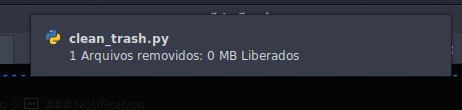

Clean Trash (by time)
===========

## Descrição
Script que limpa arquivos da lixeira depois de 1 mês ou mais de deletados

OBS: A saída do script não é o terminal, é um arquivo de log salvo em `$HOME/log/clean_trash`

### Logs
O script usa 2 arquivos de logs como saída, armazenado em `$HOME/log/clean_trash`.

Os arquivos são salvos com a data nesse formato: `%Y-%m-%d_%H:%M:%S` ficando assim:

| Arquivo | Descrição |
| ------ | ------ |
| `%Y-%m-%d_%H:%M:%S.log` | log contendo apenas a listagem dos arquivos deletados |
| `%Y-%m-%d_%H:%M:%S_summary.log` | log contendo um pqueno sumário  |

**Exemplo:**
- `2020-05-07_15:26:01.log`
- `2020-05-07_15:26:01_summary.log`

**Exemplo de Log:**
- `2020-05-07_15:26:01.log`:
```
file1.blabla
file2.txt
folder3
file4.png
file.deb
```
---

- `2020-05-07_15:26:01_summary.log`:
```
Files: 10
Size: 3.5 GB
```

### Notification

O script ainda exibe uma notificação rápida exibindo esse sumário no final da execução

Exemplo de notificação:



## Use
```bash
python3 clean_trash.py
```

